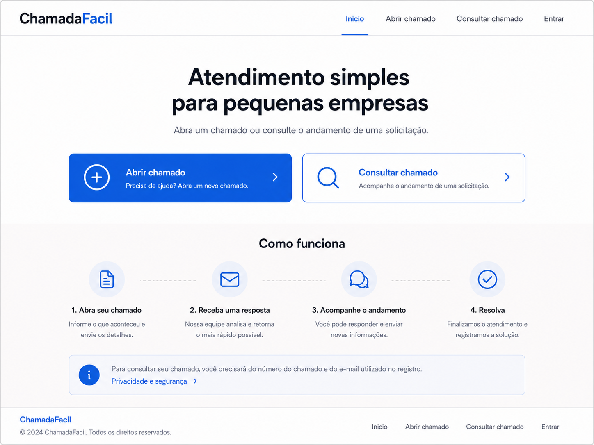
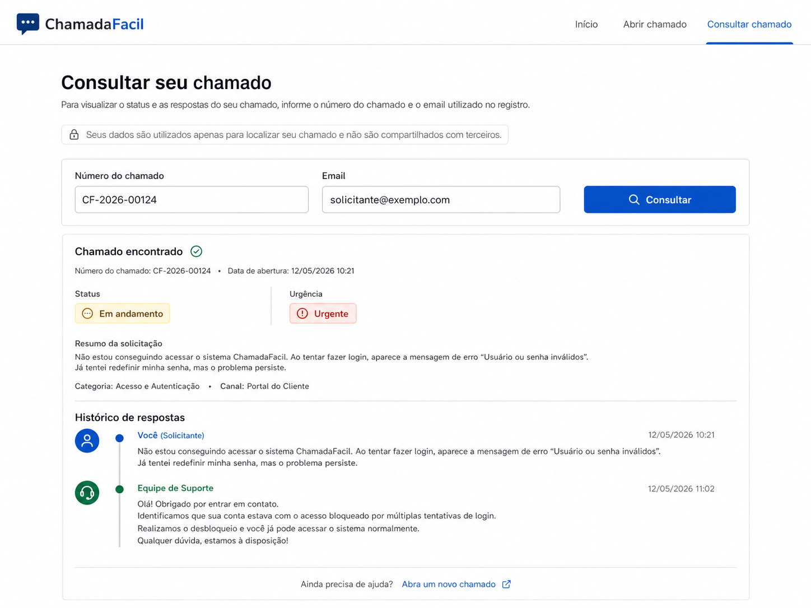
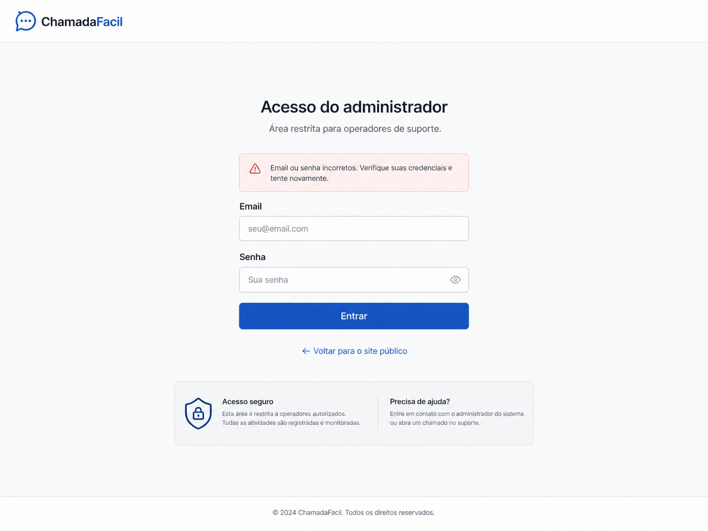
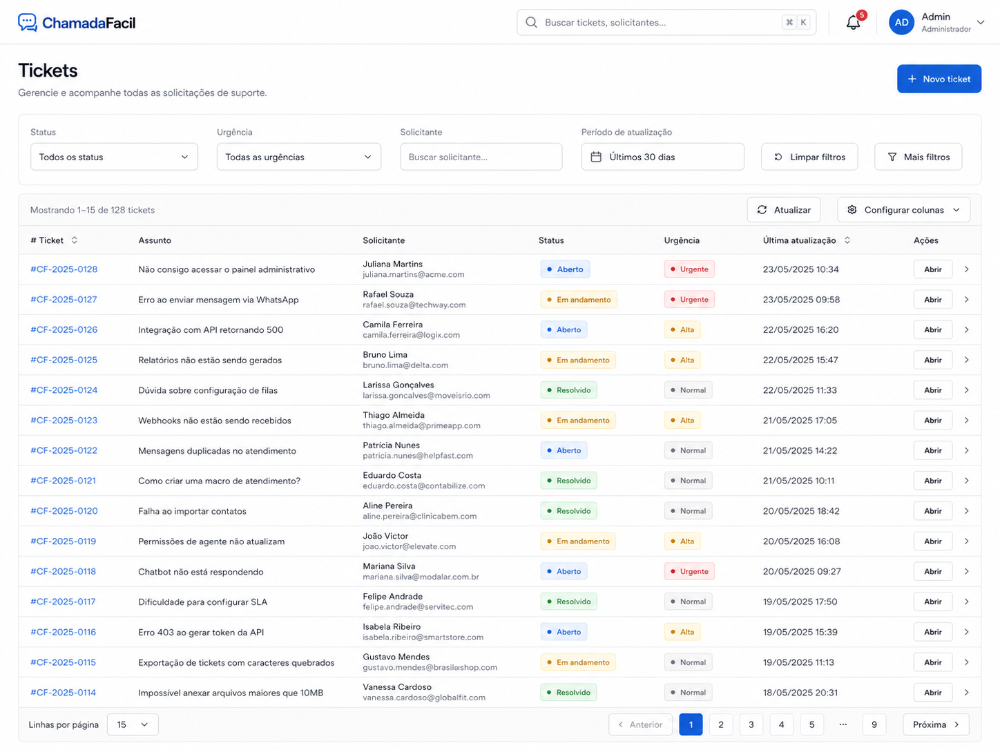
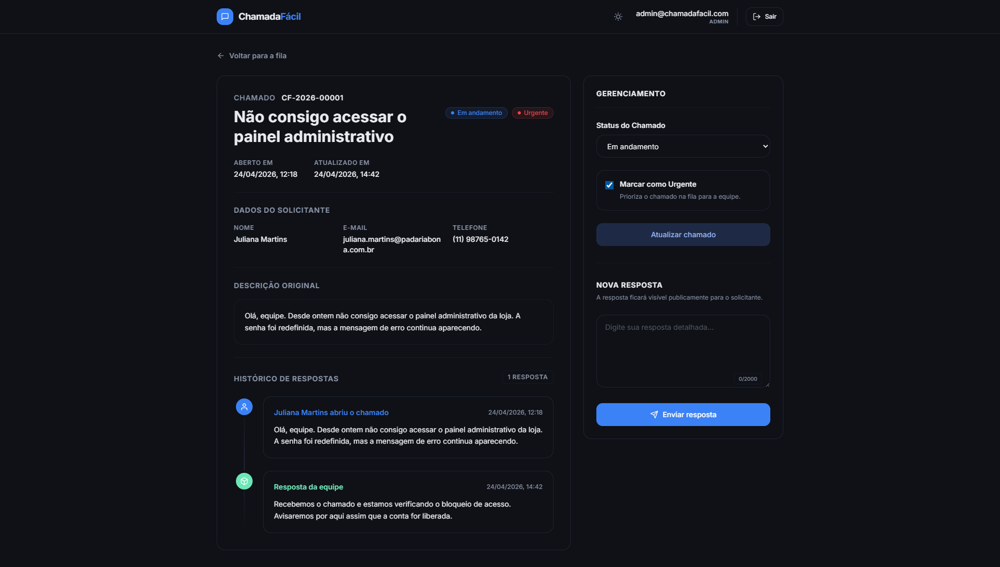

# ChamadaFácil

<p align="center">
  <strong>A web-based help desk system for small businesses in Brazil.</strong>
</p>

<p align="center">
  A full-stack application for creating, tracking, and managing support tickets through a simple and organized workflow.
</p>

<p align="center">
  <a href="#screenshots">Screenshots</a>
  ·
  <a href="./docs/CASE_STUDY.en.md">Case study</a>
  ·
  <a href="./docs/SECURITY.md">Security</a>
  ·
  <a href="./docs/DEPLOYMENT.md">Deployment</a>
  ·
  <a href="./README.md">Português</a>
</p>

> Status: functional portfolio MVP. This repository is presented as a serious portfolio project with a realistic help desk scope and no claims beyond the implemented features.

## Links

| Resource | Link |
| --- | --- |
| Demo | [chamadafacil.vercel.app](https://chamadafacil.vercel.app/) |
| Repository | [github.com/bps2414/chamadafacil](https://github.com/bps2414/chamadafacil) |
| Case study | [docs/CASE_STUDY.en.md](./docs/CASE_STUDY.en.md) |
| Portuguese README | [README.md](./README.md) |
| Deployment guide | [docs/DEPLOYMENT.md](./docs/DEPLOYMENT.md) |
| Portfolio copy | [docs/PORTFOLIO_COPY.md](./docs/PORTFOLIO_COPY.md) |
| Resume bullets | [docs/RESUME_BULLETS.md](./docs/RESUME_BULLETS.md) |
| Final checklist | [docs/FINAL_PORTFOLIO_CHECKLIST.md](./docs/FINAL_PORTFOLIO_CHECKLIST.md) |

## Overview

ChamadaFácil is a help desk web application designed for small businesses that need a clearer way to receive, track, and respond to support requests.

The product model is single-company/single-tenant: one business uses the system internally, while public requesters can create tickets and check their status without creating an account.

The project has two main user groups:

- Public requesters, who create tickets and track them with a ticket code plus e-mail.
- Admins/operators, who sign in and manage the support queue, ticket status, urgency, and public responses.

## Screenshots

Final attached screenshots prepared for the project preview, using fictional data and no real credentials.

| Screen | Preview |
| --- | --- |
| Landing page |  |
| Ticket creation |  |
| Ticket lookup |  |
| Admin login |  |
| Admin dashboard |  |
| Admin ticket detail |  |

## Core Features

| Area | Feature | Status |
| --- | --- | --- |
| Public | Brazilian Portuguese landing page | Implemented |
| Public | Public ticket creation without requester accounts | Implemented |
| Public | Automatic ticket code generation | Implemented |
| Public | Ticket lookup by code and e-mail | Implemented |
| Public | Status, urgency, request details, and response timeline | Implemented |
| Admin | Admin login with Supabase Auth | Implemented |
| Admin | Protected dashboard | Implemented |
| Admin | Responsive ticket list | Implemented |
| Admin | Filters by status and urgency | Implemented |
| Admin | Ticket detail with requester data | Implemented |
| Admin | Status and urgency updates | Implemented |
| Admin | Public operator responses | Implemented |
| UX | Loading, empty, error, and success states | Implemented |
| UX | Responsive/mobile interface | Implemented |
| Security | RLS, server-side validation, and basic rate limiting | Implemented |
| Product | Knowledge base | Not implemented; future improvement |

## Public User Flow

1. Open the landing page.
2. Create a ticket at `/tickets/new`.
3. Submit name, e-mail, optional phone, subject, and description.
4. Receive a ticket code such as `CF-2026-00001`.
5. Track the ticket at `/tickets/lookup`.
6. Enter the ticket code and e-mail.
7. View status, urgency, original request, and operator responses.

## Admin Flow

1. Open `/admin/login`.
2. Sign in with a manually created Supabase Auth account.
3. View the dashboard at `/admin`.
4. Filter tickets by status and urgency.
5. Open a ticket detail page.
6. Update status and urgency.
7. Publish a response visible to the requester.
8. Mark the ticket as resolved when the support request is complete.

## Tech Stack

| Layer | Technology |
| --- | --- |
| Web framework | Next.js App Router |
| Language | TypeScript |
| UI | React and Tailwind CSS |
| Authentication | Supabase Auth |
| Database | Supabase PostgreSQL |
| Data security | Supabase Row Level Security |
| Data access | Server Components, Server Actions, and Supabase helpers |
| Web deployment | Vercel as the primary target |

Main versions confirmed in `package.json`:

- Next.js `^16.2.4`
- React `^19.2.5`
- TypeScript `^6.0.3`
- Tailwind CSS `^4.2.4`
- `@supabase/supabase-js` `^2.105.1`
- `@supabase/ssr` `^0.10.2`

## Architecture Summary

```text
src/
  app/
    (public)/
      page.tsx
      tickets/new/page.tsx
      tickets/lookup/page.tsx
    (admin)/
      admin/login/page.tsx
      admin/page.tsx
      admin/tickets/[id]/page.tsx
  components/
    admin/
    tickets/
    ui/
  lib/
    data/
    security/
    supabase/
    validation/
supabase/
  migrations/
  seed.sql
docs/
```

Public routes:

- `/`
- `/tickets/new`
- `/tickets/lookup`
- `/abrir-chamado`, redirects to `/tickets/new`
- `/consultar-chamado`, redirects to `/tickets/lookup`

Private routes:

- `/admin/login`
- `/admin`
- `/admin/tickets/[id]`
- `/admin/tickets`, redirects to `/admin`

Layer responsibilities:

- App Router pages render public and admin screens.
- Server Actions handle ticket creation, lookup, login, ticket updates, and responses.
- `src/lib/validation` keeps form validation rules.
- `src/lib/data` keeps data access and workflow rules.
- `src/lib/security` keeps same-origin checks and public form rate limiting.
- Supabase Auth manages admin sessions.
- PostgreSQL stores tickets, responses, and rate-limit events.
- RLS protects direct database access.

## Data Model

| Table | Description |
| --- | --- |
| `tickets` | Public support requests with requester data, subject, description, status, urgency, and timestamps. |
| `ticket_responses` | Public admin/operator responses shown in the ticket lookup flow. |
| `public_rate_limits` | Abuse-control events for public forms, storing hashed subjects. |
| `auth.users` | Supabase Auth users treated as admins/operators in the MVP. |

Ticket statuses:

- `open`
- `in_progress`
- `resolved`

Current priority model:

- `is_urgent = false`: normal.
- `is_urgent = true`: urgent.

There is no knowledge-base table in the current MVP.

## Security

The security model is intentionally scoped for a single-company MVP.

Implemented measures:

- Admin authentication with Supabase Auth.
- `/admin` routes protected by Next.js Proxy and server-side checks.
- Admin Server Actions re-check the authenticated Supabase user.
- RLS enabled on `tickets`, `ticket_responses`, and `public_rate_limits`.
- Public ticket creation and lookup mediated by Server Actions.
- Server-side form validation.
- Same-origin guard for public actions.
- Basic rate limiting by IP and e-mail, storing hashed subjects.
- `SUPABASE_SERVICE_ROLE_KEY` used only on the server.
- Security headers configured in `next.config.ts`.

Known MVP limitation:

Any authenticated Supabase user is treated as an admin/operator. This is acceptable for the current single-company scope only if public signups are disabled in production and users are managed manually.

Future security improvements:

- RBAC with roles such as `admin`, `operator`, and `viewer`.
- Action-level permissions.
- Advanced audit logs.
- Edge/WAF rate limiting.
- Tenant isolation if the product evolves into a multi-company system.

See [docs/SECURITY.md](./docs/SECURITY.md) for details.

## Local Development

Requirements:

- Node.js `20.9.0` or newer.
- npm.
- Supabase CLI.
- Docker Desktop, if running Supabase locally.

Install dependencies:

```bash
npm install
```

Create the local environment file:

```bash
cp .env.example .env.local
```

On Windows PowerShell:

```powershell
Copy-Item .env.example .env.local
```

Fill the required environment variables.

To run Supabase locally:

```bash
npm run supabase:start
npm run supabase:status
npm run supabase:db:reset
```

`supabase db reset` applies migrations and runs `supabase/seed.sql`.

Run the app:

```bash
npm run dev
```

Open:

```text
http://localhost:3000
```

Local seed admin:

```text
E-mail: admin@chamadafacil.com.br
Password: admin123
```

This account is for local development only. Do not publish it as a production demo login.

Local lookup sample after seed:

```text
Ticket: CF-2026-00001
E-mail: juliana.martins@padariabona.com.br
```

The names, e-mails, and companies in the seed data are fictional demo records. They do not represent organizations served by the project.

## Environment Variables

```env
NEXT_PUBLIC_SUPABASE_URL=
NEXT_PUBLIC_SUPABASE_ANON_KEY=
SUPABASE_SERVICE_ROLE_KEY=
SITE_URL=https://chamadafacil.vercel.app
```

| Variable | Exposure | Purpose |
| --- | --- | --- |
| `NEXT_PUBLIC_SUPABASE_URL` | Public/browser-safe | Supabase project URL. |
| `NEXT_PUBLIC_SUPABASE_ANON_KEY` | Public/browser-safe | Public anon key used with RLS. |
| `SUPABASE_SERVICE_ROLE_KEY` | Server-only | Controlled public workflows and rate limiting. |
| `SITE_URL` | Public/canonical | Final domain used by canonical, Open Graph, robots, and sitemap. |

Notes:

- Variables prefixed with `NEXT_PUBLIC_` can be bundled into browser code.
- Never prefix the service role key with `NEXT_PUBLIC_`.
- Never place real secrets in README files, screenshots, logs, or public issues.
- Configure production variables in the hosting provider before building.

## Supabase Setup

1. Create a Supabase project.
2. Copy the Project URL and anon public key into `.env.local`.
3. Copy the service role key only into server-side environments.
4. Apply the migrations locally or to the remote project.
5. Disable public signups in Supabase Auth for production.
6. Manually create or invite admins/operators in Authentication > Users.
7. Confirm that only intended operators exist in `auth.users`.

Local flow:

```bash
npm run supabase:start
npm run supabase:db:reset
```

Remote flow:

```bash
npm run supabase:link
npx supabase db push
```

Do not push local seed credentials or development demo data to production.

## Deployment

The documented primary deployment target is Vercel, which is the most direct path for this Next.js App Router MVP.

Checklist:

1. Publish the repository on GitHub.
2. Import the project into Vercel.
3. Confirm the framework preset as Next.js.
4. Configure `NEXT_PUBLIC_SUPABASE_URL`, `NEXT_PUBLIC_SUPABASE_ANON_KEY`, and `SUPABASE_SERVICE_ROLE_KEY`.
5. Apply migrations to the remote Supabase project.
6. Disable public signups in Supabase Auth.
7. Manually create the admin/operator account.
8. Smoke test public and private routes.

Final verification commands:

```bash
npm run lint
npm run typecheck
npm run build
```

See [docs/DEPLOYMENT.md](./docs/DEPLOYMENT.md) for the full guide.

## Roadmap

Planned improvements, not implemented in the current MVP:

- RBAC with role-based permissions.
- Multi-company/multi-tenant support.
- E-mail notifications.
- File attachments.
- Advanced history/audit logs.
- SLA labels and overdue indicators.
- Better operational metrics.
- CSV export.
- Knowledge base.
- Internal-only operator notes.

## What This Project Demonstrates

- Data modeling for a support workflow.
- PostgreSQL migrations.
- Authentication with Supabase Auth.
- Data access protection with RLS.
- Server Actions and data access in the Next.js App Router.
- Server-side form validation.
- Basic abuse protection for public forms.
- Form UX with success, error, loading, and empty states.
- Responsive admin interface.
- Deployment-ready project documentation.

## Available Commands

```bash
npm run dev
npm run lint
npm run typecheck
npm run build
npm run supabase:start
npm run supabase:stop
npm run supabase:status
npm run supabase:db:reset
npm run supabase:link
```

There is currently no automated test script.

## Resume Bullets

- Built a full-stack web application for creating, tracking, and managing technical support tickets.
- Implemented an authenticated admin dashboard with filters, status management, urgency handling, and operator responses.
- Designed the data model for tickets, responses, and support workflows using PostgreSQL.
- Configured authentication, RLS access policies, server-side validation, and deployment-ready project structure.
- Created a responsive interface with Next.js, TypeScript, and Tailwind CSS, including loading, error, empty, and success states.

## Portfolio Card

ChamadaFácil is a help desk web application for small businesses, featuring public ticket creation, ticket lookup by code and e-mail, an authenticated admin dashboard, filters, status and urgency management, and operator responses. The project demonstrates full-stack development with Next.js, TypeScript, Tailwind CSS, Supabase Auth, PostgreSQL, and RLS within a realistic MVP scope.
