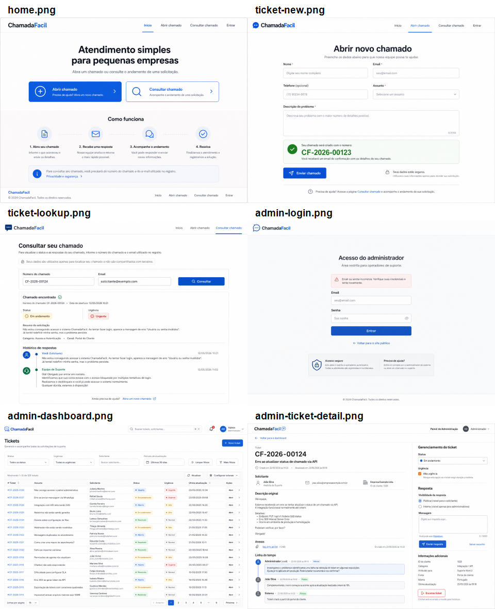
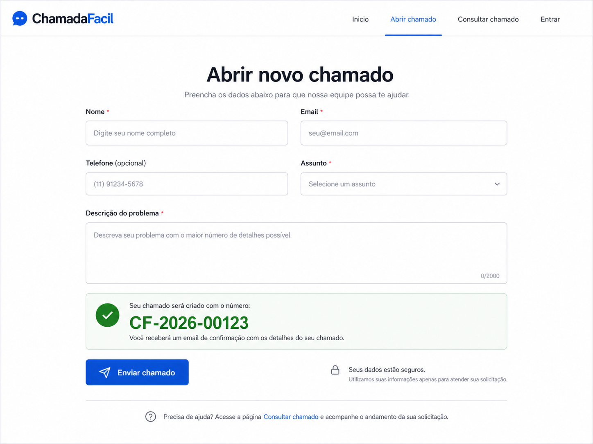
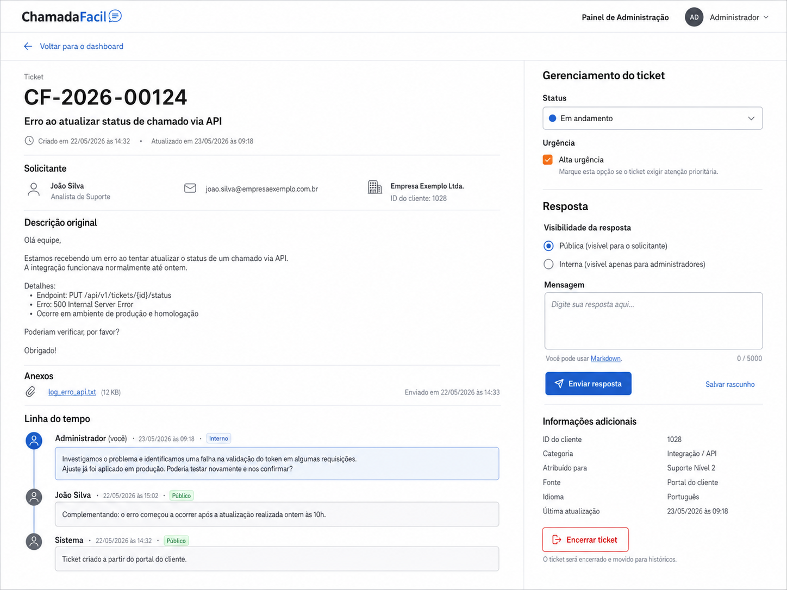

# Visual Reference: ChamadaFacil

This document is the visual source of reference for the MVP interface. Before implementing or changing UI, open the contact sheet and the route-specific image for the screen being touched.

## Reference Rule

- Always check these images before building or reviewing any public or admin screen.
- Use the images as direction for layout, density, spacing, hierarchy, color, and component behavior.
- Do not treat generated image text as exact final copy. Product behavior, route scope, labels, validation, and security rules still come from `PRD.md`, `SPEC.md`, `DESIGN_DIRECTION.md`, and `DATA_MODEL.md`.
- Keep the interface clean, practical, and consistent with a small-business support tool.
- Do not add pricing, knowledge base, chat, analytics, attachments, enterprise navigation, or unused dashboard areas unless the product scope changes.

## Design Calibration

The reference adapts the `gpt-taste` direction toward a restrained MVP instead of an overproduced landing page:

- Clear navigation and hierarchy.
- Wide, readable layouts without cramped text.
- Practical work surfaces for admin screens.
- Subtle motion may be added later, but never at the cost of accessibility or workflow clarity.
- Use generic clean sans-serif typography such as Geist, Inter, or system UI.
- Use warm white, dark neutral text, trustworthy blue actions, and accessible green, amber, and red status accents.

## Contact Sheet

## Route References

### `/`

### `/tickets/new`

### `/tickets/lookup`

### `/admin/login`

### `/admin`

### `/admin/tickets/[id]`

## Screen Inventory

| Route | Image | Purpose |
| --- | --- | --- |
| `/` | `docs/visual-reference/screens/home.png` | Public entry point with two primary actions. |
| `/tickets/new` | `docs/visual-reference/screens/ticket-new.png` | Public ticket creation flow and success state. |
| `/tickets/lookup` | `docs/visual-reference/screens/ticket-lookup.png` | Private ticket lookup by number and email. |
| `/admin/login` | `docs/visual-reference/screens/admin-login.png` | Admin authentication entry point. |
| `/admin` | `docs/visual-reference/screens/admin-dashboard.png` | Protected ticket queue and filters. |
| `/admin/tickets/[id]` | `docs/visual-reference/screens/admin-ticket-detail.png` | Ticket lifecycle management and public response form. |
